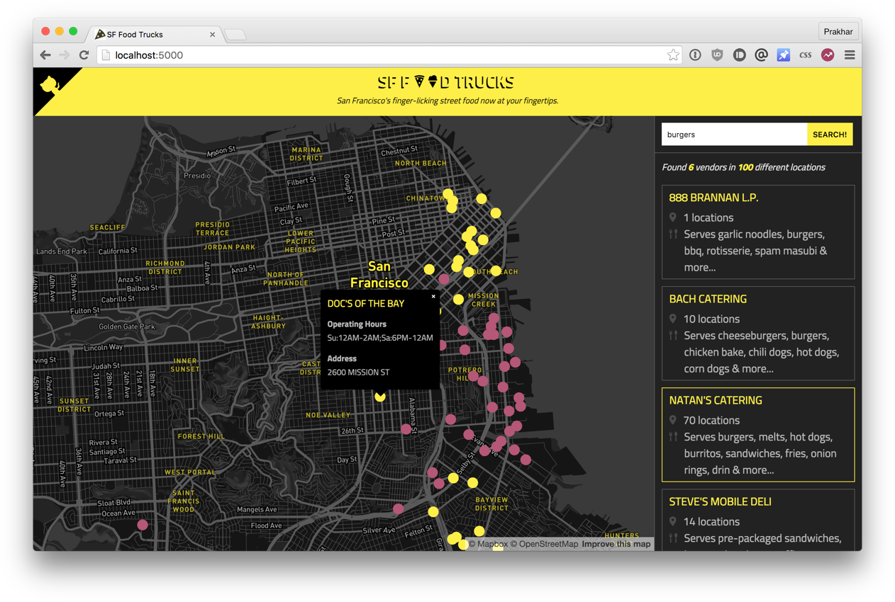
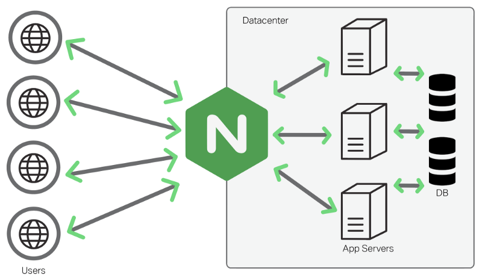

# Food Truck Finder Application

Welcome to the Food Truck Finder application, a fun project built by Prakhar Srivastav to complement the Docker curriculum. This application utilizes Flask for the backend, Elasticsearch as the search engine for powering searches, and React for the frontend. The visually appealing maps are courtesy of Mapbox.

If you find the design of the website a bit ostentatious, credit Genius for inspiring the color scheme. Lastly, the data for the food trucks is generously made available in the public domain by SF Data.

## Application Architecture

The application is composed of two services:

1. **Python Server:**
   - Serves both data and a JavaScript-based UI.
   - Built with Flask.

2. **ElasticSearch Server:**
   - Hosts the data and allows seamless searching.
   - Empowers the search functionality of the application.

## Configuration

The ElasticSearch connection details are hard-coded into `app.py`. The Flask Server runs on port 5000.

## Building & Running the Application

Before you start, make sure you have the following tools installed on your system:

- Python
- Pip
- NodeJS & NPM

Follow these steps to build and run the application:

1. Install Node.js dependencies:

    ```bash
    npm install
    ```

2. Build the frontend:

    ```bash
    npm run build
    ```

3. Install Python dependencies:

    ```bash
    pip install -r requirements.txt
    ```

4. After building, start the application by running:

    ```bash
    python ./app.py
    ```

## Additional Features

I've added and configured Nginx, and Docker Compose is used to orchestrate the services. To run the application, use the provided `init.sh` script:

```bash
#!/bin/sh
docker-compose up --build
```

This script ensures a smooth setup and initialization of the Food Truck Finder application. Enjoy exploring food trucks in your area with this delightful application!



Project Architecture

The architecture of this project follows a three-tier model, designed to efficiently handle user interactions, process business logic, and manage data. The components of the architecture are as follows:

User Interface:
Represents the point of interaction for the user.
Nginx (Web Server):
Serves as a reverse proxy, efficiently handling incoming requests from the user and directing them to the appropriate components of the application.
Application (App Server):
Contains the core business logic and acts as the intermediary between the user interface and the database. It processes incoming requests, performs necessary operations, and communicates with the database as needed.
Database:
Stores and manages the data necessary for the application.
Communication Flow
The communication within the architecture follows a structured flow:

User communicates with Nginx:
Users interact with the application by making requests through the User Interface.
Nginx forwards the request to the Application:
Nginx, as a reverse proxy, forwards user requests to the Application layer.
The Application processes the request and may communicate with the Database:
The Application layer processes incoming requests, performs business logic operations, and may interact with the Database layer to fetch or update data.
The Application sends the response back through Nginx to the User Interface:
The Application layer generates a response based on the processed request, and Nginx delivers this response back to the User Interface for presentation to the user.
This structured flow ensures a clear separation of concerns and efficient communication between the various components, contributing to a robust and scalable architecture. 

